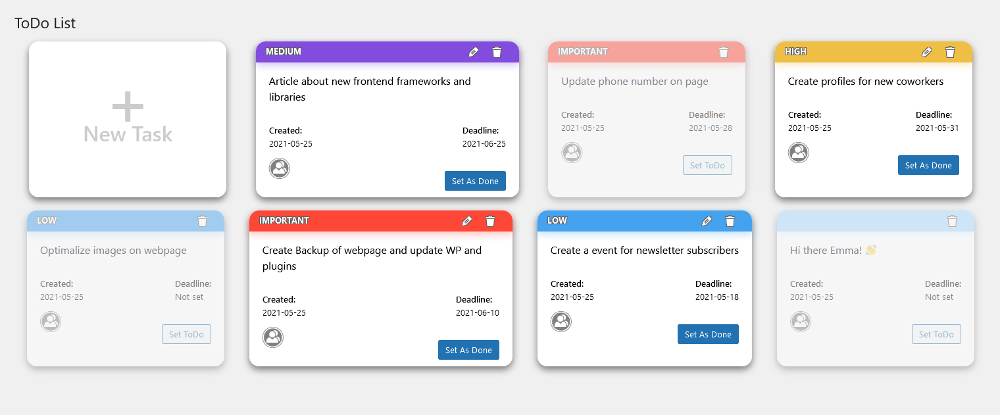

# :date: ToDo List

A small WordPress plugin.
It's my first WP plugin which I created. I hope to have time and ideas for updating and upgrade this project succesfully.
If not reqruitment task probably I've never would to start to create my own plugin, it was really fun to create it and to  learn some new stuff too! :smiley:

## :zap: Installation
Download project and add it to your wordpress page to following localization:  
`/wp-content/plugins`

After that go to your WordPress admin panel and in `Plugins` section, then just activate plugin called `ToDo List`. 
Now you should had new navigation item tab called `ToDo List`.

## :grey_question: How to use
To have access to `ToDo List` you need to had access to post editing. 
Roles like admin, author, contributor and editor can had access to plugin tab.

Adding new task:
- Press big button "New Task"
- Type task name (Required), set deadline date, select task priority level
- Press "Add Task" button

Edit task:
- Press on pencil icon on task which you want to edit
- Fill all inputs
- Press "Edit Task" to save changes.
> :information_source: INFO: This option is avilable only on not done task.

Delete task:
- Press on trash bin icon next to editing option.
> :warning: WARNING: Pressing delete task button remove it imedietly without question to confirm.

Set task as done:
- Press "Set as Done" button on task.
> :memo: NOTE: You can "undone" task by pressing "Set ToDo" button.

## Author
- Marcel Moś - Developer